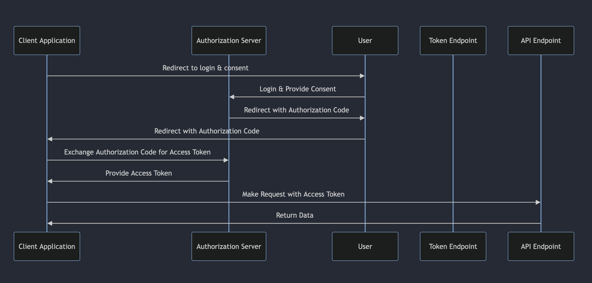

# amqp-node

### Oauth 2.0 flow

## Oauth 2.0 Authorization Server

### TODO
- [ ] Implement Logger #log @jimmy
- [ ] Refresh User Token @jimmy
- [ ] Install ELK server #log @jimmy
- [ ] CRUD: User @jimmy
- [ ] CRUD: Client @jimmy
- [ ] Profile: Change password @jimmy
- [ ] Authenticate: Reset password @jimmy
- [ ] Authorization Flow @jimmy
- [ ] Update / Edit OAuth application @jimmy
- [ ] Remove OAuth application @jimmy
- [ ] Rate limit for api call @jimmy

### Completed features ✓
- [x] Refresh Token of OAuth
- [x] Register User
- [x] Create OAuth Application