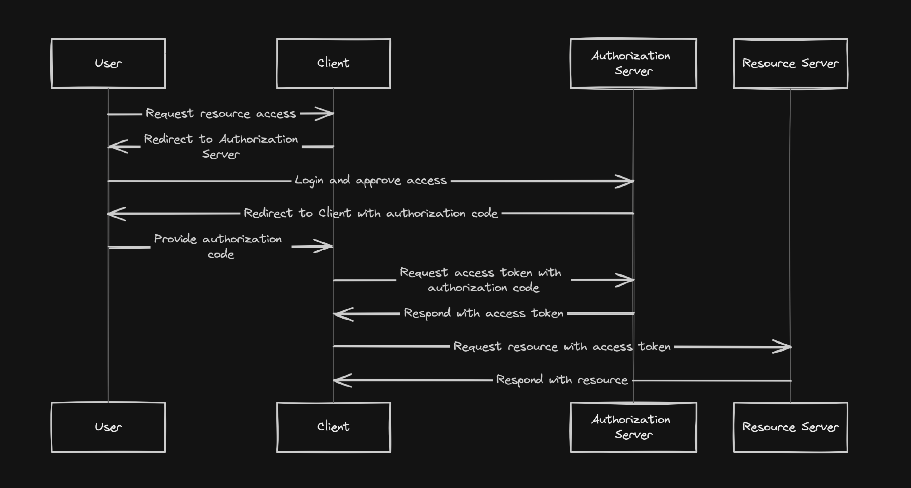

# amqp-node

### Oauth 2.0 flow

## Oauth 2.0 Authorization Server

- In this project, we have two types of Token
  - [OAuth Tokens](#oauth20-token-management).
    - Oauth token is the Authorization Server tokens, which is used for external user who is authorized with OAuth Application.
  - [User tokens](#user-token-management).
    - User token is the Tokens which is used for the user of this project.

### OAuth2.0 Token Management

### User Token management
- Each Access Token will be valid in 1 hour since created.
  - After the user refreshed their token, the old one will be moved to blacklist.
  - If the user wants to access with the old token, they would be rejected.
- Each Refresh Token will be valid in 30 days since created.
  - Depends on the business, the system will generate new RT and send back to the user after refreshed Token.
- After the user logged out.
  - The accessToken will be added into the "blacklist" to prevent further use.
  - The refreshToken need to be removed as well [TODO.

### TODO
- [ ] Implement blacklist tokens @jimmy
- [ ] Implement Logger #log #winston @jimmy @david
  - [ ] Debug
  - [ ] Error
  - [ ] Exception
- [ ] Install ELK server #log @david
- [ ] CRUD: User @jimmy
- [ ] CRUD: Client @jimmy
- [ ] Profile: Change password @jimmy
- [ ] Authenticate: Reset password @jimmy
- [ ] Revoke user AT after the token has been refreshed @jimmy
- [ ] Authorization Flow @jimmy
- [ ] Rate limit for api call @jimmy
- [ ] Encrypt Secret Key for OAuth2 Application @jimmy

### Completed features ✓
- [x] Authorize of OAuth
  - response_type
  - client_id
- [x] Get token and refresh token from OAuth @jimmy
- [x] Refresh Token of OAuth @jimmy
- [x] Register User @jimmy
- [x] Login User into system @jimmy
- [x] Implement blacklist tokens @jimmy
- [x] Refresh User Token @jimmy
- [x] Create OAuth Application @jimmy
- [x] Update / Edit OAuth application @jimmy
- [x] Remove OAuth application @jimmy